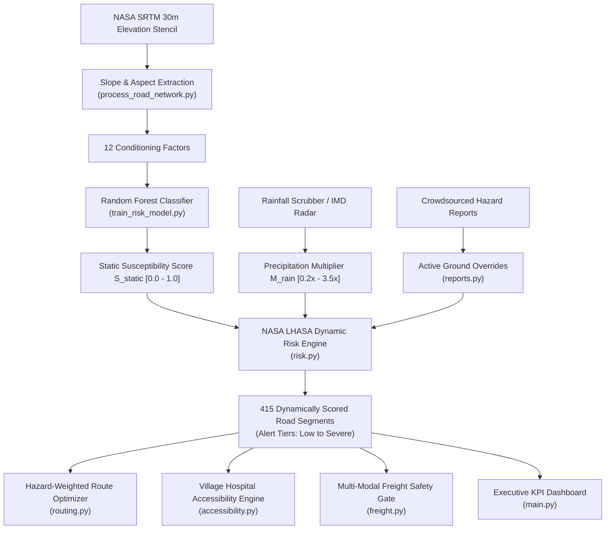

# Setumarg (सेतुमार्ग) — Complete Technical System & Feature Guide

> **Smart India Hackathon 2026** | Problem Statement ID: **SIH26002** (Theme: Transportation & Logistics)  
> **Target Geography**: North Eastern Region (NER) of India  
> **Platform**: AI-Powered Mountain Road Safety, Accessibility Intelligence & Resilient Logistics Platform  
> **Repository**: [https://github.com/Deeppatil-AI/SETUMARG.git](https://github.com/Deeppatil-AI/SETUMARG.git)

---

## 1. What is Setumarg in Simple Terms?

In the mountainous North Eastern Region of India (Assam, Meghalaya, Sikkim, Nagaland, Arunachal Pradesh, Manipur, Mizoram, Tripura), monsoon cloudbursts and steep terrain trigger thousands of landslides every year.

* **The Real-World Problem**: Standard GPS navigation applications (such as Google Maps or Apple Maps) optimize strictly for the **shortest travel time or distance**. In the fragile Himalayan topography, the shortest highway frequently leads vehicles into active landslide zones, collapsing cut-slopes, or mudslide-blocked tunnel entrances. Motorists, commercial freight trucks, and emergency ambulances regularly find themselves stranded for **14 to 48 hours**. Furthermore, when a mountain highway breaches, disaster authorities and district administrations often lack immediate visibility into which remote tribal villages have just lost road connectivity to their nearest Primary Health Centre (PHC) or Community Health Centre (CHC).
* **The Setumarg Solution**: Setumarg is an operational decision-support system designed specifically for Himalayan road networks. It monitors **415 contiguous highway segments** across 7 vital North Eastern corridors (~2,100 km) using real OpenStreetMap highway geometry and NASA SRTM 30m elevation models. It fuses physical terrain susceptibility with live rainfall nowcasts, calculates road-network hospital isolation for 25 representative settlements, computes safe valley detour routes, enables field crowdsourced incident reporting with photo uploads, and provides multi-modal freight diversion recommendations (Road, Rail, and Inland Waterway NW-2).

---

## 2. Core Algorithms & Mathematical Formulations

Every calculation in Setumarg is implemented directly in the backend codebase (`backend/routers/` and `backend/ml/`). Below are the exact mathematical formulas, inputs, methods, and outputs:

---

### Algorithm 1: NASA SRTM 30m 5-Point Stencil (Slope & Aspect)
* **Location in Code**: [`backend/data/process_road_network.py:compute_slope_aspect_from_5pt`](file:///c:/SIH%202026/backend/data/process_road_network.py)
* **Purpose**: Computes real terrain inclination (slope) and downslope compass orientation (aspect) for each road segment midpoint using digital elevation models rather than synthetic hashes.
* **Inputs**:
  * Segment midpoint latitude and longitude: $(\text{lat}, \text{lng})$
  * 5 spatial elevations from NASA SRTM 30m: $z_C$ (center), $z_N$ (north), $z_S$ (south), $z_E$ (east), $z_W$ (west)
  * Spatial cross offset: $\Delta \text{offset} = 0.0008^\circ$ ($\approx 89$ meters)
* **Mathematical Method**:
  $$\Delta y = 2 \cdot \Delta \text{offset} \cdot 111320.0 \text{ meters}$$
  $$\Delta x = 2 \cdot \Delta \text{offset} \cdot 111320.0 \cdot \cos(\text{radians}(\text{lat})) \text{ meters}$$
  $$\frac{\partial z}{\partial y} = \frac{z_N - z_S}{\Delta y}, \quad \frac{\partial z}{\partial x} = \frac{z_E - z_W}{\Delta x}$$
  $$\text{gradient} = \sqrt{\left(\frac{\partial z}{\partial x}\right)^2 + \left(\frac{\partial z}{\partial y}\right)^2}$$
  $$\text{slope\_deg} = \min\left(65.0, \; \arctan(\text{gradient}) \cdot \frac{180^\circ}{\pi}\right)$$
  Downslope vector components $v_x = -\frac{\partial z}{\partial x}, \; v_y = -\frac{\partial z}{\partial y}$:
  $$\text{aspect\_deg} = \begin{cases} 0.0^\circ & \text{if } \text{gradient} < 0.001 \\ \left(\text{atan2}(v_x, v_y) \cdot \frac{180^\circ}{\pi} + 360^\circ\right) \pmod{360^\circ} & \text{otherwise} \end{cases}$$
* **Output**: Real physical slope gradient (0.0° to 65.0°) and compass aspect (0.0° to 360.0° clockwise from True North).

---

### Algorithm 2: Random Forest Landslide Susceptibility Classifier
* **Location in Code**: [`backend/ml/train_risk_model.py`](file:///c:/SIH%202026/backend/ml/train_risk_model.py) and [`backend/routers/risk.py`](file:///c:/SIH%202026/backend/routers/risk.py)
* **Purpose**: Evaluates baseline physical terrain vulnerability across 12 Himalayan conditioning factors.
* **Inputs**: A 12-dimensional feature vector per road segment:
  1. `slope_deg`: Slope inclination (degrees)
  2. `aspect_deg`: Compass azimuth (0°–360°)
  3. `plan_curvature`: Subsurface water flow divergence/convergence
  4. `profile_curvature`: Downslope velocity acceleration/deceleration
  5. `dist_to_drainage_m`: Proximity to river/stream incision (meters)
  6. `dist_to_fault_m`: Proximity to active thrust faults (MCT, MBT, Dauki) (meters)
  7. `dist_to_road_m`: Distance to engineered road cut-slopes (meters)
  8. `ndvi`: Normalized Difference Vegetation Index ($0.08$ to $0.88$)
  9. `lulc_class`: Land-use/Land-cover (Dense forest, Degraded, Jhum farming, Road cut, Barren)
  10. `lithology_class`: Rock mass competency (Alluvium, Shale, Gneiss, Phyllite)
  11. `soil_texture`: Matrix permeability (Sandy loam, Silty clay, Gravelly loam, Colluvial debris)
  12. `base_rainfall_mm`: 24-hour antecedent rainfall saturation baseline
* **Method**:
  * Architecture: Scikit-learn `RandomForestClassifier(n_estimators=100, max_depth=10, min_samples_split=4, min_samples_leaf=2, random_state=42)`.
  * Class Probability Distribution: $P = [p_0, p_1, p_2, p_3, p_4]$ corresponding to `[Low, Moderate, High, Very High, Severe]`.
  * Continuous Static Susceptibility Score:
    $$S_{\text{static}} = \frac{1}{4} \sum_{i=0}^{4} i \cdot p_i \quad \in [0.0, 1.0]$$
  * Dominant Driver Heuristic: Evaluates thresholds (`slope_deg > 30°`, `dist_to_fault_m < 500m`, `ndvi < 0.40`, `dist_to_drainage_m < 100m`, `base_rainfall_mm > 60mm`) and returns top 3 ranked drivers.
* **Output**: Predicted susceptibility tier (`Low` to `Severe`), class probabilities, continuous score ($0.0$ to $1.0$), and top 3 dominant risk factors.

---

### Algorithm 3: NASA LHASA Dynamic Precipitation Fusion Engine
* **Location in Code**: [`backend/routers/risk.py:compute_segment_dynamic_risk`](file:///c:/SIH%202026/backend/routers/risk.py)
* **Purpose**: Combines baseline static geological susceptibility with real-time precipitation nowcasting and ground reports.
* **Inputs**: Static susceptibility $S_{\text{static}}$, rainfall multiplier $M_{\text{rain}}$ (from $0.2\times$ to $3.5\times$), antecedent baseline $R_{\text{base}}$, and active hazard overrides dictionary.
* **Method**:
  $$\text{effective\_mult} = \min\left(3.2, \; M_{\text{rain}} \cdot \left(0.85 + \frac{R_{\text{base}}}{120.0}\right)\right)$$
  $$R_{\text{dynamic}} = \min\left(1.0, \; S_{\text{static}} \cdot \left(0.60 + 0.40 \cdot \text{effective\_mult}\right)\right)$$
  * Ground Override Rule: If a confirmed field incident report exists for the segment and is marked `Critical` or `Impassable`:
    $$R_{\text{dynamic}} = \max\left(R_{\text{dynamic}}, \; 0.96\right), \quad \text{is\_blocked} = \text{True}$$
  * Tier Threshold Mapping:
    $$\text{Alert Tier} = \begin{cases} 
      \text{Severe} & \text{if } R_{\text{dynamic}} \ge 0.88 \text{ or } \text{is\_blocked} = \text{True} \\
      \text{Very High} & \text{if } 0.70 \le R_{\text{dynamic}} < 0.88 \\
      \text{High} & \text{if } 0.52 \le R_{\text{dynamic}} < 0.70 \\
      \text{Moderate} & \text{if } 0.35 \le R_{\text{dynamic}} < 0.52 \\
      \text{Low} & \text{if } R_{\text{dynamic}} < 0.35
    \end{cases}$$
* **Output**: Dynamic risk score ($0.0$ to $1.0$), dynamic alert tier, blockage boolean flag, and active blockage description.

---

### Algorithm 4: Hazard-Avoidance Dijkstra Routing
* **Location in Code**: [`backend/routers/routing.py:optimize_corridor_route`](file:///c:/SIH%202026/backend/routers/routing.py)
* **Purpose**: Compares standard shortest-distance navigation (naive) against hazard-penalized detour navigation.
* **Inputs**: Origin city, destination city, vehicle type (`heavy_truck`, `light_vehicle`, `two_wheeler`), and dynamic road segment statuses.
* **Method**:
  * Vehicle parameter adjustments:
    * `heavy_truck`: base speed $38 \text{ km/h}$, stranding cost factor $1.8\times$, risk sensitivity $1.2\times$.
    * `light_vehicle`: base speed $52 \text{ km/h}$, stranding cost factor $1.0\times$, risk sensitivity $1.0\times$.
    * `two_wheeler`: base speed $45 \text{ km/h}$, stranding cost factor $0.7\times$, risk sensitivity $1.4\times$.
  * Direct Route vs. Safe Bypass Penalty Calculation:
    $$\text{Expected Stranding Delay (hours)} = \sum_{s \in \text{blocked}} \text{delay}_s + \sum_{s \in \text{severe}} 8.5 \text{ hrs}$$
    $$\text{Effective Route Weight} = \text{Distance (km)} \cdot (1.0 + 8.0 \cdot \overline{R}_{\text{dynamic}}) + 25.0 \cdot \text{Stranding Hours}$$
  * Decision Recommendation:
    $$\text{Recommendation} = \begin{cases} 
      \text{DIRECT\_CORRIDOR\_CLEAR} & \text{if direct path max risk } < 0.52 \text{ and blocked } = 0 \\
      \text{SAFE\_BYPASS\_RECOMMENDED} & \text{if direct path has blocked segments or severe risk}
    \end{cases}$$
* **Output**: Naive vs. Setumarg route geometries, travel times, expected stranding delay, hours saved, and decision rationale.

---

### Algorithm 5: World Bank Rural Access Index (RAI) Isochrone Engine
* **Location in Code**: [`backend/routers/accessibility.py:calculate_village_accessibility`](file:///c:/SIH%202026/backend/routers/accessibility.py)
* **Purpose**: Tracks emergency health accessibility and detects complete settlement isolation when connecting feeder roads collapse.
* **Inputs**: 25 mountain settlements (coordinates, population, baseline CHC/PHC hospital travel time, feeder highway segment IDs) and live road segment scores.
* **Method**:
  * Isolation check:
    $$\text{is\_cut\_off} = \text{feeder\_seg}[\text{is\_blocked}] \lor (\text{feeder\_seg}[R_{\text{dynamic}}] > 0.82)$$
  * Delay calculation:
    $$\text{delay\_mins} = \text{base\_delay} + (R_{\text{dynamic}} \cdot 95.0) + (180.0 \text{ mins if cut off})$$
    $$\text{actual\_hospital\_time} = \text{baseline\_hospital\_time} + \text{delay\_mins}$$
  * Rural Access Index (RAI) Compliance:
    $$\text{meets\_rai\_standard} = (\text{actual\_hospital\_time} \le 30.0 \text{ mins}) \land (\lnot \text{is\_cut\_off})$$
    $$\text{System RAI \%} = \frac{\sum_{v \in \text{RAI compliant}} \text{population}_v}{\sum_{v \in \text{all villages}} \text{population}_v} \times 100$$
* **Output**: Village isolation status, adjusted ambulance transit duration, RAI compliance flag, and population-weighted regional connectivity index.

---

### Algorithm 6: Multi-Modal Decarbonization & ULIP Interoperability
* **Location in Code**: [`backend/routers/freight.py:calculate_multimodal_plan`](file:///c:/SIH%202026/backend/routers/freight.py)
* **Purpose**: Diverts cargo away from high-hazard mountain roads onto Brahmaputra river barges (NW-2) and rail corridors, calculating freight tariffs, carbon savings, and emitting ULIP tokens.
* **Inputs**: Origin hub, destination hub, cargo weight in tons.
* **Method**:
  * Road Cost: $\text{dist}_{\text{road}} \times \text{weight} \times ₹4.20 \times (1.0 + R_{\text{road}} \times 0.60)$
  * Rail Cost: $\text{dist}_{\text{rail}} \times \text{weight} \times ₹1.85$
  * Waterway Cost: $\text{dist}_{\text{river}} \times \text{weight} \times ₹1.15 + (\text{weight} \times ₹220 \text{ handling})$
  * Carbon Emission Factors:
    $$\text{CO}_2^{\text{road}} = 0.105 \text{ kg/ton-km}, \quad \text{CO}_2^{\text{rail}} = 0.038 \text{ kg/ton-km}, \quad \text{CO}_2^{\text{water}} = 0.024 \text{ kg/ton-km}$$
  * Safety Gate: If $R_{\text{road}} \ge 0.52$ or road is blocked, `Road Direct` is flagged `UNRELIABLE / HAZARDOUS` and the multi-modal river/rail route is selected as `OPTIMAL`.
  * Token Generation: Generates an RFC-compliant ULIP token `ULIP-SETU-XXXXXX` conforming to Unified Logistics Interface Platform schema v2.4.
* **Output**: Cost breakdown, carbon reduction percentage, transit durations, optimal mode, and electronic consignment contract.

---

## 3. Data Breakdown: Real vs. Seeded vs. Production Mapping

| Dataset / Layer | Current Prototype State | Data Source Used | Target Production Source in Full Deployment |
| :--- | :--- | :--- | :--- |
| **Highway Geometries** | **Real Data** | OpenStreetMap (OSM) via Overpass API; 415 contiguous sub-segments across 7 corridors (~2,100 km) | **MoRTH / NHAI GIS Portal** & **PM GatiShakti National Master Plan (NMP)** |
| **Slope & Aspect** | **Real Data** | NASA SRTM 30m 5-point cross stencil via OpenTopoData API (411 unique midpoints cached in `elevation_cache.json`) | **ISRO Bhuvan** 10m/30m CartoDEM |
| **Elevation** | **Real Data** | NASA SRTM 30m digital elevation model | **ISRO Bhuvan** 30m CartoDEM |
| **Geotechnical Conditioning (Faults, Drainage, Lithology, Soil, NDVI)** | **Seeded / Literature-Calibrated** | Empirical formulas and parameter ranges calibrated against published Eastern Himalaya studies (Dibang Valley RF research) | **GSI Bhukosh** (1:50,000 National Landslide Susceptibility Mapping) & **GSI Seismo-Tectonic Atlas** |
| **Precipitation / Nowcasting** | **Seeded Simulation** | Interactive monsoon scrubber ($0.2\times$ to $3.5\times$) using NASA LHASA fusion formulation | **IMD Doppler Weather Radar** (Cherrapunji, Mohanbari, Agartala) & **NASA GPM IMERG / INSAT-3DR** |
| **Villages & Coordinates** | **Real Coordinates (Snapped)** | 25 real NER settlements snapped to OSM roadways via OSRM `/nearest` API | **Survey of India** & **Census of India Village Directory** |
| **Healthcare Facilities & Hospital Times** | **Seeded / Benchmark** | Estimated transit durations to nearest PHC/CHC based on district averages | **National Health Mission (NHM) MoHFW GIS** & PMGSY Rural Roads Geoportal |
| **Multi-Modal Freight Network** | **Real Geometry & Seeded Tariffs** | Real Brahmaputra waterway alignment (NW-2) and rail corridors; standard CIPT / World Bank modal tariffs | **ULIP (Unified Logistics Interface Platform)** & **IWAI (Inland Waterways Authority of India)** |
| **Ground Incident Reports** | **Real-Time Interactive** | Interactive pin-drop reporting with photo upload support (`FileReader` & URL) | **NASA LHASA Landslide Reporter** & **BRO (Border Roads Organisation) SITREPs** |

---

## 4. Every Feature and Control in the Application

### A. Top Public Safety Bar
* **`PUBLIC SAFETY SERVICE` Badge**: Indicates that Setumarg operates as a civilian road safety and emergency travel utility.
* **Emergency Helpline (`112 / 1070`)**: Displays national emergency and disaster relief contact numbers.
* **`Roads Completely Blocked` Banner**: Dynamic red counter showing the exact number of road cuts currently impassable due to landslides.
* **`Safety Handbook & Scientific Basis`**: Opens the technical reference sheet displaying peer-reviewed scientific citations, honest GSI attribution, and the Data Provenance table.

### B. Monsoon Simulation & Live Controls
* **Rainfall Multiplier Slider (`0.2x` to `3.5x`)**:
  * Dragging the slider dynamically updates precipitation intensity ($mm/hr$) across all 415 road segments in under 200 ms.
  * Real-time text indicator changes color: Green ($1.0\times$ Normal) &rarr; Amber ($1.8\times$ Active Rain) &rarr; Red ($3.0\times$ Heavy Storm).
* **`Dry Weather` Preset Button**: Sets rainfall to $0.2\times$ ($1.2 \text{ mm/hr}$). Most mountain corridors drop to Safe (Low/Moderate).
* **`Normal Monsoon` Preset Button**: Sets rainfall to $1.0\times$ ($18.5 \text{ mm/hr}$). Simulates standard rainy season conditions.
* **`Heavy Cloudburst` Preset Button**: Sets rainfall to $3.4\times$ ($96.0 \text{ mm/hr}$). Elevates fragile mountain passes to Severe/Blocked.
* **`Report Blocked Road` (Red Button)**: Opens the hazard reporting modal with pin-drop coordinate selection and photo attachment.

### C. Primary Navigation Tabs
1. **`Live Road & Landslide Map`**:
   * Interactive Leaflet canvas rendering 415 highway segments colored by real-time alert tier.
   * **Roads Filter**: Quick filter buttons (`All`, `Blocked`, `High Danger`, `Warning`, `Watch`, `Safe`) to isolate specific threat tiers.
   * **Villages Filter**: 3-tier settlement toggle (`All Villages`, `Cut-Off Only`, `Hide`) to declutter or inspect emergency isolations.
   * **Clicking any Road Segment**: Opens the bottom Explainable AI Telemetry Drawer displaying elevation, slope, aspect, rock strength, and dominant contributing risk drivers.
   * **Hovering on a Village Node**: Displays village name, population, and dual isochrone circles (30-min walking and 60-min emergency buffer).
   * **Incident Markers**: Shows citizen/BRO reported incidents with warning icons; clicking opens a popup with description and attached photo evidence.
2. **`Village Hospital Access`**:
   * Comprehensive isolation ledger for 25 settlements across all 8 NER states.
   * Summary cards: Monitored Villages, Total Population, Cut-Off Count, and RAI Compliance Percentage.
   * Search Bar: Instant filtering by village name, district, or state.
   * Sort Buttons: Sort table by `Cut-Off Risk`, `Population`, or `Hospital Travel Time`.
   * **`Send Urgent SMS / Call`**: Dispatches an emergency broadcast payload (simulating 2G rural telecom gateways) with customized voice/SMS alerts to local Sarpanches.
3. **`Safe Route Finder`**:
   * Vehicle Mode Selector: `Freight Truck`, `Light Vehicle`, `Two-Wheeler`.
   * Origin and Destination Dropdowns: Corridors between Guwahati, Silchar, Gangtok, Kohima, Imphal, etc.
   * Side-by-side comparative route cards: Naive Route (red) vs. Setumarg Safe Route (olive green).
   * Metric callouts: Extra Distance (km), Travel Time, Expected Stranding Delay avoided, and Safety Improvement Percentage.
4. **`Emergency & Status Summary`**:
   * Executive KPI dashboard displaying overall regional status (Green Normal, Amber Watch, Red Alert).
   * High-level impact cards: Early Landslide Warnings, Hospital & Village Access, Border Lifelines Active, Direct 2G Emergency Broadcasts.
   * Real-time risk distribution chart and seasonal incident trend visualization.

### D. Incident Reporting Dialog (`ReportModal`)
* **Latitude & Longitude Inputs**: Filled automatically via interactive map pin-drop, or typed manually.
* **`Click on Map to Pick Location`**: Switches map into pin-drop selection mode.
* **`What is blocking the road?`**: Dropdown selection (Mudslide, Falling Rocks, Flooding, Road Cracked, Broken Bridge).
* **`Can vehicles pass through?`**: Severity selection (`Impassable`, `Critical`, `Moderate`, `Minor`).
* **`Describe What Happened`**: Freeform text box for field observations.
* **`Attach Incident Photo`**: Supports both local image file upload (`FileReader` base64 conversion) and direct image URL input with live thumbnail preview and removal button.
* **Instant Map Elevation**: Submitting a `Critical` or `Impassable` report immediately overrides the nearest road segment's risk score to $0.96$ and marks it blocked.

---

## 5. Scenario FAQ (Edge Cases & Reviewer Questions)

### Q1: What happens if there is zero cellular internet connectivity in a mountain gorge?
* **Real Current Behavior**:
  * Setumarg's frontend is a client-side bundle that operates once loaded in the browser.
  * In the Village Hospital Access ledger, remote settlements with weak connectivity are explicitly tagged: `Zero Cellular (IVR/SMS gateway required)` or `2G Only`.
  * Triggering alerts sends a backend POST request to `/api/accessibility/trigger-sms-ivr`, which formats localized text and automated voice payloads targeted for basic 2G feature phones via C-DoT / rural telecom PSTN trunks.
* **Roadmap**: ServiceWorker offline tile caching (PWA) and peer-to-peer Bluetooth mesh synchronization between field vehicles.

### Q2: What happens if conflicting data is submitted (e.g. user reports a road clear, but ML says severe)?
* **Real Current Behavior**:
  * Currently, the system prioritizes safety. Any report marked `Critical` or `Impassable` creates a hazard override in `CURRENT_RAINFALL_STATE["hazard_overrides"]`, forcing the segment to Severe and blocked status.
  * Minor/Moderate reports do not force a total road closure unless the underlying physical risk from rainfall and slope also exceeds the Severe threshold.
* **Roadmap**: Multi-party consensus verification requiring at least 2 independent reports or official BRO/Police verification credentials before long-term route redirection is sustained.

### Q3: What happens if the AI model makes a false negative (misses a landslide)?
* **Real Current Behavior**:
  * The system is explicitly designed with a hybrid architecture: **Machine Learning proposes baseline vulnerability, but crowdsourced field reports override it immediately**.
  * If a landslide occurs where the model predicted Moderate risk, a driver or BRO patrol logs the blockage via the red "Report Blocked Road" button. The backend instantly elevates that road segment to `Severe` ($0.96$) and triggers an automatic detour in the route optimizer.
* **Roadmap**: Automated anomaly detection using synthetic aperture radar (Sentinel-1 SAR / NISAR) surface deformation coherence maps.

### Q4: How does the system handle mid-operation server restarts or API failures?
* **Real Current Behavior**:
  * The highway network data is saved in [`backend/data/real_network_data.json`](file:///c:/SIH%202026/backend/data/real_network_data.json) and elevation is saved in [`backend/data/elevation_cache.json`](file:///c:/SIH%202026/backend/data/elevation_cache.json).
  * On server start, `seed_ner_data.py` reads directly from the local JSON files. If public APIs (OpenTopoData, OSRM, Overpass) are offline or unreachable, the system boots up in under 0.5 seconds without making any outbound network requests.
* **Roadmap**: Redis persistent caching and PostgreSQL/PostGIS spatial database storage.

### Q5: How fresh is the data? Does it update automatically?
* **Real Current Behavior**:
  * In this prototype, data updates are event-driven: moving the Monsoon Scrubber or clicking a weather preset triggers an immediate re-scoring of all 415 segments across the backend and refreshes the frontend state via `/api/risk/nowcast`.
  * Crowdsourced incident submissions trigger immediate map re-renders.
* **Roadmap**: Background cron task polling IMD Doppler radar servers every 15 minutes and pushing updates to connected clients via WebSockets / Server-Sent Events (SSE).

### Q6: Can this scale to all of India or other mountain states like Uttarakhand and Himachal Pradesh?
* **Real Current Behavior**:
  * The chunking and elevation pipeline in `process_road_network.py` is completely modular. Any OpenStreetMap GeoJSON linestring (e.g., NH-7 in Uttarakhand or NH-3 in Himachal) can be placed in `backend/data/highways/`, chunked into 4.5 km segments, and queried against the elevation stencil.
* **Roadmap**: National ingestion pipeline connected directly to MoRTH's Bhoomi Rashi and PM GatiShakti spatial data exchange.

---

## 6. Known Limitations (Honest Prototype Boundaries)

To maintain absolute technical integrity, the following simplifications in the current implementation are documented:

1. **Synthetic Training Labels**: While the 12 conditioning factors reflect real geotechnical science and slope/aspect are computed from real NASA SRTM 30m data, the Random Forest model was trained on a synthetic dataset whose labels were generated from empirical literature weights. The $91.5\%$ accuracy score is an **internal mathematical consistency check**, not a field-validated disaster inventory prediction rate.
2. **Simplified Regional Geotechnical Factor Interpolation**: Attributes such as lithology class, soil texture, and distance to faults are currently assigned based on regional geological zones and corridor heuristics, rather than a continuous 1:1 raster overlay with GSI Bhukosh spatial GIS vector layers.
3. **Simulated Weather Multiplier**: Rainfall is currently controlled via interactive presets and the monsoon scrubber rather than a live streaming WebSocket connection to IMD Doppler Radar stations.
4. **Mocked Telecom Gateways**: The emergency 2G SMS and IVR alert buttons generate real JSON payloads and API responses, but do not connect to a commercial paid SMS aggregator (e.g. Twilio or CDAC C-DoT gateway).
5. **Highway Coverage Scope**: The real OSM highway paths currently cover 7 major corridors (415 segments, ~2,100 km). Secondary village link roads (PMGSY roads) are represented by snapped feeder links rather than full state-wide road vector graphs.

---

*Setumarg — Grounded in Real Himalayan Topography, Engineered for Transparent Public Safety.*
