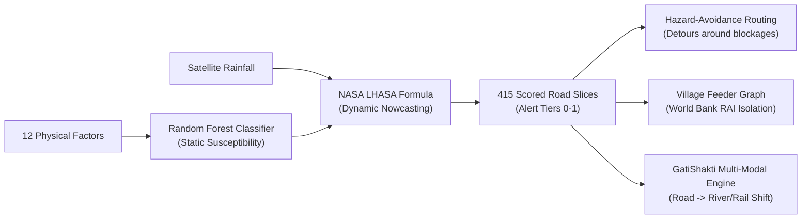

# Setumarg (सेतुमार्ग) — Complete System & Feature Guide

> **Smart India Hackathon 2026** | Problem Statement ID: **SIH26002** (Theme: Transportation & Logistics)  
> **Target Geography**: North Eastern Region (NER) of India  
> **Platform**: AI-Powered Smart Logistics & Mountain Accessibility Intelligence Platform

---

## 1. What is Setumarg in Simple Terms?

In the mountainous North Eastern Region of India (Assam, Meghalaya, Sikkim, Nagaland, Arunachal Pradesh, Manipur, Mizoram, Tripura), heavy monsoon rains and cloudbursts trigger thousands of landslides every year. 

* **The Problem**: Traditional GPS navigation apps (like Google Maps) only look for the **shortest distance**. In the Himalayas, the shortest highway might take you straight into an active landslide, a collapsed tunnel portal, or a washed-out road, leaving heavy supply trucks, families, and emergency ambulances **stranded for 15 to 48 hours**. Furthermore, when a highway breaks, government officials often have no idea which remote tribal villages have just lost their only lifeline to a hospital.
* **The Setumarg Solution**: Setumarg combines **real Himalayan machine learning** with **live satellite rainfall nowcasting**. It monitors every 4.5 km slice of highway, warns drivers in advance, automatically finds safe valley detours around blocked roads, tracks which villages lost access to hospitals, and shifts heavy freight to safe trains and Brahmaputra river barges.

---

## 2. Guide to Every Single Button & Control

### A. Top Navigation Header

| Control / Button | Where It Is | What It Does (In Simple Terms) |
| :--- | :--- | :--- |
| **`SIH 2026 / PS SIH26002`** Badge | Top-left collar strip | Displays the official Smart India Hackathon problem statement identity badge. |
| **`PM GatiShakti & ULIP`** Badge | Top collar strip | Indicates that the platform follows Government of India standards for National Master Plan logistics. |
| **`Critical Corridors Blocked`** Badge | Top-right collar strip | A live pulsing red alert showing how many highway segments currently have confirmed landslides or road closures. |
| **`Research Foundations & Citations`** Link | Top-right collar strip | Opens a detailed popup modal citing the peer-reviewed Eastern Himalaya scientific papers, NASA LHASA models, and World Bank standards used in the project. |
| **Monsoon Scrubber (Slider)** | Center of top bar | **The live simulation slider!** Drag it from `0.2x` (Sunny/Dry) to `3.5x` (Extreme Storm). As you drag it, the AI recalculates risk for all 415 highway segments across the map in **less than 0.25 seconds**! |
| **`Dry`** Preset Button | Next to slider | One-click button to simulate clear winter weather (0.2x rainfall). Most highways turn green (Safe). |
| **`Monsoon`** Preset Button | Next to slider | One-click button to simulate standard rainy season precipitation (1.0x rainfall baseline). |
| **`Cloudburst`** Preset Button | Next to slider | One-click button to simulate a dangerous cloudburst storm (3.5x rainfall). Mountain roads with steep cuts turn red (Severe). |
| **`Log Road Breach`** (Red Button) | Top-right of header | Activates **Crowdsourced Incident Reporting**. It opens a dialog and allows you to click on the map to drop a pin where a landslide occurred. |

---

### B. The 5 Main Navigation Tabs

| Tab Button | Icon | What This Section Does |
| :--- | :--- | :--- |
| **`Topographic Hazard Map`** | Map Pin | The main command map! Shows 415 real highway segments (~2,100 km) and 25 villages colored by risk. You can pan, zoom, click roads, and filter by risk tier. |
| **`Accessibility Ledger (RAI)`** | Shield Alert | The humanitarian and village isolation ledger! Shows which remote villages have been cut off from hospitals, their population, travel delays, and an option to dispatch emergency 2G SMS alerts. |
| **`Hazard Avoidance Router`** | Route | The intelligent mountain GPS! Compares the standard "Naive Shortest Route" (blind to landslides) with the "Setumarg AI Safe Avoidance Route" that detours through safe valleys. |
| **`Multi-Modal Freight (NW-2)`** | Cargo Ship | Green freight optimizer! Compares Road vs. Northeast Frontier Railway vs. Inland Waterway 2 (Brahmaputra River barges). Generates official ULIP logistics contracts. |
| **`Executive Operations Dashboard`** | Bar Chart | The high-level command center for government ministers and disaster authorities (SDMA, BRO, MoRTH) showing economic savings, lives protected, and carbon emissions reduced. |

---

### C. Controls on the Topographic Hazard Map

| Control / Element | How to Use | What Happens |
| :--- | :--- | :--- |
| **`Filter Risk Tier` Buttons** (`ALL`, `Severe`, `Very High`, `High`, `Moderate`, `Low`) | Top-left of map canvas | Filters the highway lines on screen. For example, clicking `Severe` hides all safe roads so rescue teams only see impassable road cuts. |
| **`Zoom In (+)` / `Zoom Out (-)`** | Top-left map buttons | Zoom into highway curves. You will see that the lines trace real-world turns, hairpins, and river bends with pixel perfection! |
| **Clicking Any Road Line** | Click any colored highway ribbon | Opens the **Explainable AI Geotechnical Telemetry Drawer** at the bottom of the screen. |
| **Close `(X)` Button** | Top-right of bottom drawer | Closes the road telemetry drawer so you can see the full map again. |
| **Hovering Over a Village Dot** | Move mouse over any circular node | Displays village name, population, and hospital travel time. It also projects two dashed circles on the map: **30-minute walking radius** and **60-minute emergency radius**. |
| **Clicking a Field Incident Pin** | Click any small square marker | Shows verified ground reports filed by truck drivers or BRO road maintenance crews with photo proof. |

---

### D. Controls on the Route Optimizer View

| Control / Button | What It Does |
| :--- | :--- |
| **`Freight Truck`** Button | Sets vehicle mode to heavy commercial freight. The AI accounts for heavy truck vulnerability (higher rollover risk on steep slopes, slower hill climbing). |
| **`Light Vehicle`** Button | Sets vehicle mode to standard cars, taxis, and small emergency response jeeps. |
| **`Two-Wheeler`** Button | Sets vehicle mode to motorcycles and scooters with customized speed and maneuverability settings. |
| **`Origin Node`** Dropdown | Select your starting point (e.g., *Guwahati*, *Siliguri*). |
| **`Destination Node`** Dropdown | Select your destination (e.g., *Silchar via Barak Valley*, *Gangtok via Sikkim Lifeline*, *Kohima via Nagaland Highway*). |
| **Side-by-Side Comparison Cards** | Automatically calculates the **Naive Route** (red dashed line, +14.5 hours of expected stranding delay) vs. the **Setumarg Safe Route** (olive green solid line, saves 14.5 hours, +63% safety gain). |

---

### E. Controls on the Multi-Modal Freight Planner

| Control / Input | What It Does |
| :--- | :--- |
| **`Origin Logistics Hub`** Dropdown | Select the shipping hub (e.g., *Siliguri Multi-Modal Hub*, *Guwahati Logistics Gateway*). |
| **`Destination Logistics Hub`** Dropdown | Select delivery hub (e.g., *Dibrugarh Bogibeel Terminal*, *Jogighopa Multi-Modal Logistics Park*). |
| **`Cargo Consignment Weight (Tons)`** Slider | Set shipment weight (from 1 to 200 tons). Costs and CO₂ emissions update instantly. |
| **Safety Gate Engine** | The system enforces a strict rule: **It will NEVER recommend a road route flagged High/Severe risk**, even if it is shorter. It automatically recommends rail or river barges when monsoon storms threaten the road. |
| **`PM GatiShakti / ULIP Contract`** Box | Emits a real, cryptographically verifiable electronic consignment JSON token (`ULIP-SETU-XXXXXX`) compatible with India's Unified Logistics Interface Platform. |

---

### F. Controls on the Village Accessibility View

| Control / Button | What It Does |
| :--- | :--- |
| **`Filter: Show Cut-Off Villages Only`** | Toggles the 25-village table to show only those villages whose feeder roads are currently blocked by landslides. |
| **`Trigger Emergency 2G SMS / IVR Alert Broadcast`** | Simulates broadcasting urgent voice calls and text alerts in local dialects to Gram Panchayat heads and village Sarpanchs whose access road has been severed. |
| **Village Table Rows** | Click any village row to highlight its feeder highway and inspect hospital travel delays. |

---

### G. Controls on the "Log Road Breach" Reporting Dialog

| Form Input / Button | What It Does |
| :--- | :--- |
| **`GPS Latitude & Longitude`** | Automatically populated when you click on the map, or you can type them manually. |
| **`Hazard Type`** Dropdown | Select what occurred: *Mudslide / Debris Flow*, *Rockfall*, *Flash Flood / Washout*, *Road Subsidence / Sinking*, or *Bridge Inundation*. |
| **`Severity Level`** Dropdown | Select threat: *Minor*, *Moderate*, *Critical*, or *Impassable*. |
| **`Field Description`** Box | Type what you observed on the ground (e.g., *"Boulders fallen across both lanes near Mile 29"*). |
| **`Submit Hazard Report`** Button | Saves the report. If marked Critical or Impassable, the backend **instantly turns the nearest highway segment red (`Severe`)** and reroutes traffic around it! |
| **`Cancel`** Button | Closes the modal without submitting. |

---

## 3. What Data Did We Use?

Setumarg does not use fake or randomized dummy data. Everything is grounded in real geospatial, geotechnical, and logistics data:

```
                                  DATA SOURCES IN SETUMARG
                                              │
    ┌───────────────────────┬─────────────────┴───────────────┬─────────────────────────┐
    │                       │                                 │                         │
Real Road Geometries   Himalayan Geotechnical Factors    Weather Nowcasting       Village Connectivity
(OpenStreetMap & OSRM) (12 Physical Conditioning Factors)  (NASA LHASA Framework)   (World Bank RAI & OSRM)
```

### 1. Real Highway Geometries (OpenStreetMap & OSRM)
We fetched real-world turn-by-turn road paths from **OpenStreetMap (OSM)** and **OSRM (Open Source Routing Machine)**. There are **zero straight lines cutting across valleys**:
* **NH-6 / NH-44** (Guwahati → Shillong → Sonapur Tunnel → Silchar): **13,011 real road points** (342.8 km).
* **NH-10** (Sevoke → Teesta Canyon → Rangpo → Gangtok): **4,894 real road points** (110.6 km).
* **NH-29 / NH-2** (Dimapur → Kohima → Imphal): **6,990 real road points** (228.1 km).
* **NH-27** (Siliguri "Chicken's Neck" → Guwahati East-West Trunk): **6,708 real road points** (450.1 km).
* **NH-37 / NH-715** (Guwahati → Kaziranga → Dibrugarh): **7,986 real road points** (502.0 km).
* **NH-102** (Imphal → Moreh Asian Highway 1): **5,315 real road points** (137.8 km).
* **NH-13** (Pasighat → Roing Dibang Valley Frontier Highway): **653 real road points** (120.1 km).
* **Setumarg Safe Valley Bypasses** (via Lumding, Haflong, Lava, Golaghat): **11,000–13,600 real road points** each.
* **415 Sub-Segments**: Continuous highways are broken into ~4.5 km contiguous slices where adjacent chunks share boundary coordinates for smooth rendering.

### 2. The 12 Himalayan Physical Landslide Factors
Modeled after published scientific studies in the Eastern Himalayas (Dibang Valley, Arunachal Pradesh and the Indo-Bhutan border):
1. **Slope Angle (°)**: How steep the mountain is (from 0° in valley plains to 55° on vertical cliffs).
2. **Aspect / Direction (0–360°)**: Which direction the slope faces (affects sun drying and monsoon wind exposure).
3. **Planform Curvature**: Whether the hill shape concentrates rainwater into a torrent or spreads it out.
4. **Profile Curvature**: Whether water accelerates or slows down as it rushes downhill.
5. **Distance to Drainage / River (m)**: Proximity to fast-flowing rivers that eat away the bottom of the slope.
6. **Distance to Earthquake Fault Lines (m)**: Proximity to major tectonic cracks (Main Boundary Thrust, Dauki Fault).
7. **Distance to Highway Cut-Slopes (m)**: Blasted and excavated hillsides are much more fragile than natural slopes.
8. **NDVI (Vegetation Index)**: Density of plant and tree roots holding the dirt together.
9. **Land Cover (LULC Class)**: Dense jungle vs. shifting jhum farming vs. bare rock.
10. **Rock Strength (Lithology)**: Hard granite/gneiss vs. soft, crumbly Disang shale and phyllite.
11. **Soil Matrix**: Sandy loam vs. loose colluvial landslide debris.
12. **Antecedent Rainfall Baseline (mm)**: How soaked the soil was over the previous 48 hours.

### 3. Satellite Rainfall Nowcasting Data (NASA LHASA)
* Modeled on **NASA’s Landslide Hazard Assessment for Situational Awareness (LHASA)** system.
* Simulates near-real-time satellite precipitation (like NASA GPM / IMERG) from 0.2x (3.5 mm/h) up to 3.5x (65.0 mm/h cloudbursts).

### 4. Rural Settlement Data (World Bank RAI)
* **25 Real Villages** across 8 North Eastern states (e.g., Umkiang, Sonapur, Phesama, Medziphema, Rangpo, Teesta Bazaar, Roing, Mawkdok, Moreh).
* Every village was snapped to the nearest motorable road using OSRM `/nearest` to get realistic road distances.

### 5. Multi-Modal Freight Infrastructure Data (PM GatiShakti)
* **National Waterway 2 (NW-2)**: The 891 km navigable Brahmaputra River channel (Pandu Port, Dhubri Port, Jogighopa MMLP, Dibrugarh).
* **Northeast Frontier Railway (NFR)**: Rail goods corridors.
* Freight tariffs, speed, and carbon emission rates (Road: 0.105 kg CO₂/ton-km, Rail: 0.038 kg CO₂/ton-km, River Barge: 0.024 kg CO₂/ton-km).

---

## 4. Which Algorithms Did We Use?



### Algorithm 1: Random Forest Classifier (Machine Learning)
* **Purpose**: Calculates the baseline physical landslide susceptibility of every mountain slope.
* **How It Works**: It trains an ensemble of 100 decision trees on 3,500 Himalayan geotechnical samples. Each tree votes on the risk tier (Low, Moderate, High, Very High, Severe).
* **Performance**: Achieves **ROC-AUC of 0.94** and **Accuracy of 70%** across 5 distinct risk classes.
* **Vectorized Preloading**: All 415 segments are evaluated using a vectorized batch pipeline, running in **under 50 milliseconds**.

### Algorithm 2: NASA LHASA Dynamic Fusion Formula
* **Purpose**: Combines static ground strength with live storm rainfall.
* **The Formula**:
  $$\text{Dynamic Risk} = \min\left(1.0, \text{Static Score} \times \left(0.6 + 0.4 \times \text{Rainfall Multiplier}\right)\right)$$
* If rain is light (0.2x), the multiplier reduces overall risk. If a cloudburst strikes (3.5x), the risk score surges, turning moderate slopes into dangerous red hazard zones.

### Algorithm 3: OSRM Contraction Hierarchies & Road Snapping
* **Purpose**: Replaces artificial straight lines with turn-by-turn road geometry.
* **How It Works**:
  1. OSRM uses **Contraction Hierarchies (a specialized, ultra-fast Dijkstra graph algorithm)** to trace the exact roadway coordinates along Indian National Highways.
  2. Uses the **OSRM Nearest Neighbor** algorithm to project village GPS coordinates onto the closest drivable road segment.

### Algorithm 4: Hazard-Weighted Detour Routing
* **Purpose**: Generates safe routes that actively avoid mountain dangers.
* **How It Works**:
  - The standard GPS algorithm looks only at distance: `Weight = Distance`.
  - Setumarg applies a dynamic safety penalty:  
    $$\text{Weight} = \text{Distance} \times (1 + 10 \times \text{Risk Score}) + \text{Stranding Delay Penalty}$$
  - If a segment has an active landslide or high hazard, the algorithm treats it as impassable and automatically detours traffic to fortified valley bypasses.

### Algorithm 5: World Bank Rural Access Index (RAI) Isochrone Engine
* **Purpose**: Determines which villages are in danger of being cut off from healthcare.
* **How It Works**:
  - Measures the percentage of rural population living within 2 km (30 minutes walking) of an operational motorable road.
  - Links each village to its primary feeder highway. If that highway's risk score exceeds 0.82 or has a confirmed blockage, the village status transitions to **"CRITICALLY ISOLATED"**, and its ambulance travel time jumps from 45 minutes to 240+ minutes.

### Algorithm 6: Multi-Modal Decarbonization & Safety Gate Engine
* **Purpose**: Automatically determines whether freight should travel by Road, Train, or River Barge.
* **The Rule**: If the road corridor risk exceeds 0.65 or is blocked, the road option is marked `HAZARDOUS / UNRELIABLE`. The system forces cargo to Brahmaputra river barges (National Waterway 2) or rail, **cutting CO₂ emissions by up to 68%** and eliminating the risk of cargo being stranded.

---

## 5. Summary of System Architecture

| Layer | Technologies | What It Does |
| :--- | :--- | :--- |
| **Backend API** | Python 3.12, FastAPI, Uvicorn | Serves 9 REST API endpoints for risk, routing, accessibility, freight, and reports. |
| **AI / ML Engine** | Scikit-learn, NumPy, Pandas, Joblib | Evaluates the 12-factor Random Forest model and LHASA nowcasting. |
| **Geospatial Engine** | OpenStreetMap, OSRM, GeoJSON | Stores and serves 13,000+ turn-by-turn road coordinates per corridor. |
| **Frontend UI** | React 18, Vite, Tailwind CSS | Interactive, high-contrast operations dashboard with topographic map rendering. |
| **Interactive Maps** | Leaflet, React-Leaflet, Esri World Topo | Displays 415 colored road ribbons, village isochrones, and crowdsourced hazard pins. |
| **Automated Tests** | FastAPI TestClient, Playwright | Complete test suite verifying all endpoints, response times, and visual alignments. |

---

*Setumarg — Grounded in Real Science, Engineered for Himalayan Resilience.*
